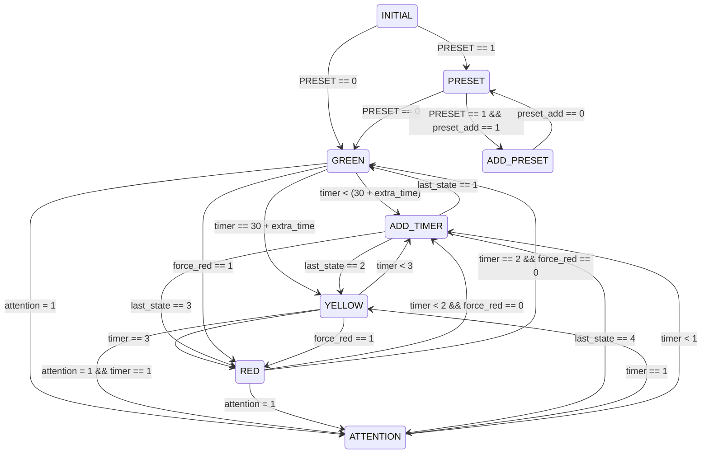
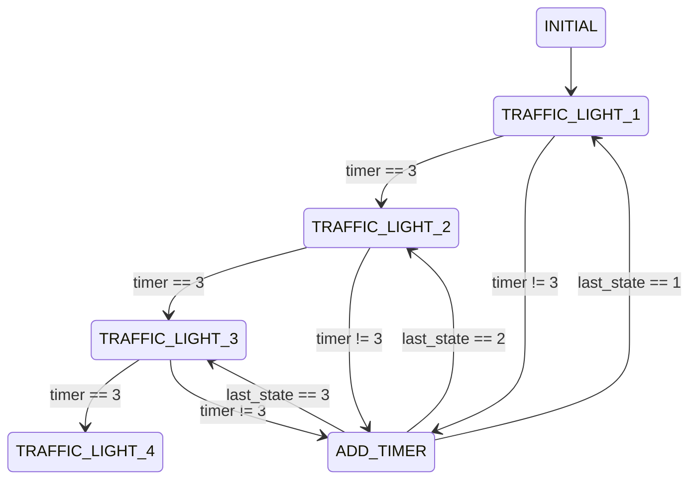

# TrafficLightSV
A Inteligent TrafficLight description in SystemVerilog

## STATES

### TRAFFIC LIGHTS

### TOP_LEVEL

## PINS

- clk -> Clock (50MHz)
- rst -> Reset
- attention -> Input to insert traffic lights in attention (blinking yellow)
- presets\[3:0\] -> Start preset mode for traffic lights (must first have been in rst), that way you can add +10 seconds with preset_adds input
- preset_adds\[3:0\] -> Add +10 seconds every time it goes 1 and 0
- force_reds\[3:0\] -> Force a traffic light to go RED (used for sensor)
- preferentials\[3:0\] -> Set a traffic light as preferential
- ltfs\[3:0\]\[2:0\] -> The LEDS of the Traffic Lights
